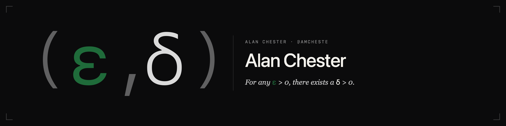

 0, there exists a δ > 0." width="100%">

---

I lead product management & strategy at Oracle (OCI Operations). Over 15+ years I've worn a lot of hats — engineer, security expert, product manager, internal consultant — and built cloud platforms from the ground up: secured funding, bootstrapped engineering teams, shipped the product, then worked directly with enterprise teams to drive adoption.

This is the second major technology transition I've navigated. The first was cloud — I built the platforms that made it possible. Now it's AI, and the pattern is identical.

## Why I build

`ε` is whatever the world demands — uptime, accuracy, security, ROI.
`δ` is the move that meets it. The data says when to pivot.

My CS degree taught me to architect production systems. Applied Math lets me see under the hood of AI models. My security background means I see the risks others gloss over. My MBA (in progress) is sharpening the finance lens to *prove* ROI, not just assume it.

All of it serves one obsession: **efficiency**.

## What I'm building

**Production AI systems**
- **[claude-teams-operator](https://github.com/amcheste/claude-teams-operator)** — Kubernetes operator that runs Claude Code Agent Teams as distributed pods
- **[ea-agent](https://github.com/amcheste/ea-agent)** — AI-powered personal executive assistant built around Obsidian
- **[paper-skills](https://github.com/amcheste/paper-skills)** — Claude Code skills for academic paper triage and Obsidian integration

**Experiments where the data taught me something**
- **[golf-coach-agent](https://github.com/amcheste/golf-coach-agent)** — AI Golf Coach using Vision LLMs for swing analysis
- **[pokemon-red-ai](https://github.com/amcheste/pokemon-red-ai)** — Reinforcement learning toolkit for training AI agents to play Pokémon Red

**Tooling**
- **[mac-dev-setup](https://github.com/amcheste/mac-dev-setup)** — One command to go from zero to fully productive on macOS

## Connect

- **LinkedIn** — [in/amcheste](https://linkedin.com/in/amcheste)
- **Email** — [amcheste@gmail.com](mailto:amcheste@gmail.com)

---

  <code>∀ ε > 0, ∃ δ > 0</code> 
  The data drives the pivot.

